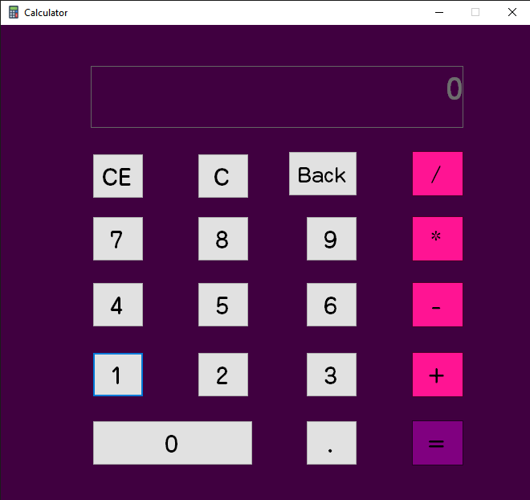
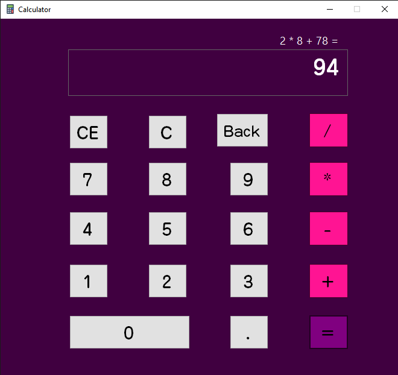

<div align="center">


# Calculator

</div>

## About the Project

- Basic arithmetic operations: Addition, Subtraction, Multiplication, Division
- Intuitive graphical user interface
- Error handling for invalid input

## Screenshot





## Getting Started

### Prerequisites

- [.NET Framework](https://dotnet.microsoft.com/download/dotnet-framework) (suitable version for VB.Net projects)
- Visual Studio or any compatible IDE for VB.Net

### Running the Project

1. Clone the repository:
   ```bash
   git clone https://github.com/Spike271/Calculator.git
   ```
2. Open the project in Visual Studio.
3. Build and run the solution.

## Usage

- Enter numbers using the calculator interface.
- Use the operation buttons (`+`, `-`, `×`, `÷`) to perform calculations.
- Click `=` to view the result.
- Use `C` or `Clear` to reset the input.

## Contributing

Contributions are welcome! Please fork the repository and submit a pull request.

## Author

- [Spike271](https://github.com/Spike271)
